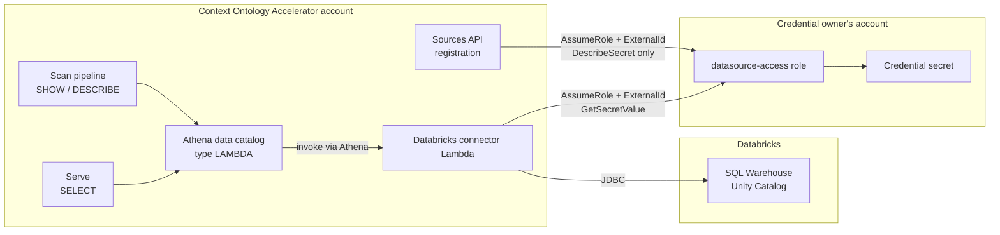

# Databricks SQL Warehouse Sources

How to onboard one Unity Catalog schema on a **Databricks SQL Warehouse** as a
`DATABRICKS_SQL_WAREHOUSE` source. There is nothing for you to deploy: Context
Ontology Accelerator operates the connector Lambda that reaches the warehouse,
and registration is a form. What you supply is the warehouse to read, a Secrets
Manager secret holding the Databricks credential, and an IAM role that Context
Ontology Accelerator may assume to read that secret.

> `{prefix}` is the deployment prefix `{project}-{env}` (e.g. `accelerator-dev`);
> `{project}` and `{env}` are its two halves, which SSM paths keep separate.
> `<accelerator-account>` is the account where Context Ontology Accelerator is
> deployed. The secret and the role may live in that account or in any other.



Two platform roles assume yours and **both must be on its trust policy**: the
sources API once at registration, to prove the wiring before the source exists,
and the connector on every request. Only the connector ever reads the credential's
value.

Discovery and queries both go through the connector, so **nothing else in the
platform holds a Databricks credential** — and a successful first scan is itself
proof the serve path works, because it exercises the catalog, the assume, the
secret, the driver and the warehouse in one pass.

## What each side owns

| Concern | Owner |
|---|---|
| The SQL Warehouse — size, auto-stop, serverless or classic, and its compute bill | You |
| Unity Catalog grants on the catalog, schema and tables | You |
| The Databricks credential and the Secrets Manager secret holding it | You |
| The IAM role that reads that secret, its trust policy and its permission policy | You |
| The connector Lambda, its deployment, its cost and its alarms | Context Ontology Accelerator |
| Athena data catalog registration and teardown | Context Ontology Accelerator |
| Metadata discovery, enrichment, review and query execution | Context Ontology Accelerator |

Context Ontology Accelerator writes nothing in your Databricks workspace and
nothing on your secret. Deleting the source leaves the role and the secret
behind, reusable for the next one — and yours to clean up if there is no next one
(see [Delete the source](#6-delete-the-source)).

## Before you start

- [ ] A SQL Warehouse, running or with an auto-stop window you have chosen deliberately (see [Cost](#cost-you-should-know-before-the-bill))
- [ ] The warehouse's **server hostname** and **HTTP path**, from its *Connection details* tab
- [ ] The Unity Catalog **catalog** and the one **schema** this source will expose
- [ ] Unity Catalog grants including **`SELECT` on every table** — visibility is not readability, see below
- [ ] A Secrets Manager secret in **this deployment's Region**, holding a personal access token or an OAuth client id and secret
- [ ] An IAM role named **`{prefix}-datasource-access-*`** at the **root IAM path**, trusting **both** platform principals with the namespace's External ID, and permitted to `DescribeSecret` and `GetSecretValue` on that one secret
- [ ] Not a PrivateLink-only workspace — the connector runs in the platform's VPC, which has no path to your workspace's private endpoint

## 1. Grant Unity Catalog access

The credential needs three things, and the third is the one that gets missed:

```sql
GRANT USE CATALOG ON CATALOG main TO `coa-service-principal`;
GRANT USE SCHEMA  ON SCHEMA main.sales TO `coa-service-principal`;
GRANT SELECT      ON SCHEMA main.sales TO `coa-service-principal`;
```

!!! warning "`information_schema` visibility is not `SELECT`"
    A table visible with `BROWSE` or `USE SCHEMA` but not `SELECT`-able is
    **discovered, enters the ontology, and then fails at serve** — the failure
    lands on whoever asks the question, months after onboarding.

    Worse, Unity Catalog **privilege-filters `information_schema` results**
    rather than raising an error: an under-privileged principal produces a
    *successful* scan of a subset, which is indistinguishable from a small
    schema. Nothing in the scan reports it. Grant `SELECT` on the whole schema,
    and check the table count on the source's detail page against what you
    expect.

Declared constraint rows are privilege-filtered the same way, so a foreign key
whose parent table the principal cannot see is silently absent.

## 2. Store the Databricks credential

The secret's **JSON shape selects the authentication mode**, so you cannot
declare one mode and store the other:

| Mode | Secret value |
|---|---|
| OAuth machine-to-machine (**recommended**) | `{"client_id": "…", "client_secret": "…"}` |
| Personal access token | `{"token": "dapi…"}` |

```bash
aws secretsmanager create-secret \
  --name "databricks/analytics-m2m" \
  --secret-string '{"client_id":"…","client_secret":"…"}' \
  --region <deployment-region>
```

`--region` is not optional here even when your CLI profile already defaults to it:
the secret must be in this deployment's Region (see below), and a secret created
against an inherited default is the single most common way to end up with one that
is not.

Machine-to-machine is the documented recommendation: a personal access token
carries a **user's** identity and expires on a schedule that user, not you,
controls — so the source stops working when someone's token lapses or their
account is closed.

!!! note "This secret needs no namespace tag"
    Unlike a JDBC credential secret, it needs no `<prefix>:namespace` tag in
    either account. The platform never reads this secret with its own identity —
    every read happens inside a session obtained by assuming the role below — so
    which secrets are reachable is decided by that role's permission policy, which
    you write. The `create-secret` above is the whole command — there is no `--tags`
    argument to add for this source type.

Two more things to plan for:

- **The secret must be in this deployment's Region.** Athena does not support
  cross-Region federated queries, and the AWS secrets standard requires
  region-scoped secrets. Registration rejects a secret outside the Region.
- **A service principal's OAuth secret expires — 90 days by default.** Rotate it
  in place on the same secret; the connector picks the new value up within its
  cache TTL and Context Ontology Accelerator is not involved. Note that an
  expired secret and a *wrong* one fail the same Databricks token exchange, so
  both present as an **authentication failure**, not as an unreadable
  credential: if queries start failing with a Databricks authentication error,
  check the secret's age before you check its IAM policy.

## 3. Create the credential-access role

Context Ontology Accelerator never authorizes against your secret. The connector
holds `sts:AssumeRole` and **nothing at all on Secrets Manager or KMS**, so it
reads the credential only as a session assumed from a role you own — which means
you can revoke it unilaterally, and the secret can live wherever your security
model wants it.

Three rules first, because each of them fails in a way that is hard to read
backwards from the error.

!!! important "The role's name is part of the contract"
    The role's name **must start with** `{prefix}-datasource-access-`, for example
    `{prefix}-datasource-access-databricks`. Context Ontology Accelerator's
    assume grant is scoped to that name prefix, so a correctly-configured role
    under any other name is denied by the platform's own identity policy, with an
    error that names nothing useful. Registration therefore rejects the name at
    submit and tells you the prefix, rather than letting it arrive as an opaque
    `AccessDenied` at the first scan.

    You do not have to work `{prefix}` out: the connect form shows the literal
    string this deployment requires, and rejects a role name that does not start
    with it before the request is sent.

!!! important "The role must be at the root IAM path, not under a path of your own"
    The prefix is matched against **everything after `role/` in the ARN**, because
    that is what IAM itself matches: the platform's assume grant names
    `arn:aws:iam::*:role/{prefix}-datasource-access-*`, and an ARN's resource
    portion includes the role's IAM path. So a role created with
    `--path /team/a/` — ARN
    `arn:aws:iam::<account>:role/team/a/{prefix}-datasource-access-databricks` —
    does **not** match, however correctly its trailing name is spelled.
    Registration refuses it and says so.

    If your organization mandates IAM paths for other role classes, this role is an
    exception to that convention rather than something the platform can accommodate:
    a path cannot be added to the reserved prefix without widening the assume grant
    to every path. Create the role with no `--path` (the default `/`).

!!! note "The role's account is unconstrained — including this one"
    The assume grant is account-agnostic (`arn:aws:iam::*:role/…`). Context
    Ontology Accelerator is deployed **into** your account, so for a
    single-account deployment the role and the secret naturally live there, and
    that is the common case rather than an exception. What bounds the platform is
    the reserved name prefix plus the role's own trust policy.

!!! warning "A secret in a different account from the role needs a customer-managed key"
    This is the one AWS constraint the platform can neither impose nor relax. The
    read happens as the assumed session — a principal in the **role's** account —
    and a secret encrypted with the AWS-managed `aws/secretsmanager` key cannot
    be read from outside its own account by any policy, because that key's policy
    is not editable. Put the secret in the same account as the role and the
    AWS-managed key is fine; split them and the secret must use a
    customer-managed key.

### Resolve the two principals your trust policy must name

**Two Context Ontology Accelerator roles touch this credential's access path, and
the trust policy must name both.** Neither is the discovery or enrichment role
other source types use, and seeing two platform principals on your role is
expected rather than a sign one of them is a mistake:

| Principal | When | What it does |
|---|---|---|
| **Sources API role** | Once, at registration | Assumes your role and calls `DescribeSecret` through that session, to prove the wiring works before the source exists. It never reads the secret's value |
| **Connector role** | Every metadata and record request | Assumes your role and reads the credential, to open a session to the warehouse |

Omit the sources-API role and **registration itself fails** — the create is
refused at submit, before the source is created, because that is the principal
performing the check. Omit the connector role and registration succeeds while
every scan and every query is denied.

Both are published in SSM — one lookup each:

```bash
# The connector role — assumes your role on every request.
aws ssm get-parameter \
  --name "/{project}/{env}/connectors/databricks/deployment/role-arn" \
  --query Parameter.Value --output text

# The sources API role — assumes it once, at registration.
aws ssm get-parameter \
  --name "/{project}/sources/api-role-arn" \
  --query Parameter.Value --output text
```

Read both ARNs from these parameters rather than assembling them from the
deployment prefix.

**The two paths are shaped differently, and that is not a typo.** The connector's
parameters carry an environment segment (`/{project}/{env}/connectors/…`) because
two environments in one account each deploy their own connector; the platform's
role parameters do not (`/{project}/sources/api-role-arn`), matching their siblings
`db-connector-role-arn`, `db-enrichment-role-arn` and
`federation-provisioner-role-arn`. Copy each path as written — reading the second
with an environment segment returns nothing.

The managed deploy also prints the connector role at the end of its log, and the
connector stack emits it as a CloudFormation output, so whoever deployed it can
send it to you without a lookup. The parameters are the durable copies: they can
be re-read at any time, which is what to use when onboarding a second source
months later.

### Read the External ID

Every assume presents an **External ID derived from the namespace** the source
belongs to. It is computed server-side and is **never** accepted from an API
request — that is what stops someone who can create sources in one namespace from
pointing a source at another namespace's role and reading its credential.

Two places to read it, both showing the same value:

- The **Connect source** form displays it beside the role ARN field, with a copy
  button. It is displayed, never typed.
- `GET /namespaces/{namespaceId}` returns it as `datasourceExternalId`.

Do not re-derive it. One role per namespace serves every Databricks source in
that namespace; if you want one role per secret, create several roles all
carrying the same namespace-scoped condition.

### Trust policy

```json
{
  "Version": "2012-10-17",
  "Statement": [
    {
      "Effect": "Allow",
      "Principal": {
        "AWS": [
          "<sources API role ARN from above>",
          "<connector role ARN from above>"
        ]
      },
      "Action": "sts:AssumeRole",
      "Condition": {
        "StringEquals": { "sts:ExternalId": "<datasourceExternalId>" }
      }
    }
  ]
}
```

One statement with both principals, one condition — the two roles present the
same External ID, so splitting them into two statements buys nothing and makes it
easier to condition only one of them.

The `sts:ExternalId` condition is **mandatory, not optional**. An assume
presenting no External ID is denied by the platform's own policy, but a trust
policy that *omits the condition* accepts one anyway — and is then assumable on
behalf of any namespace in the deployment. The condition is what turns the trust
policy into an authorization list, so **removing it is never the fix** for an
`AccessDenied`: it makes the assume succeed for every namespace, which is the
cross-tenant exposure the condition exists to prevent. If the assume is denied,
the cause is a missing principal or a mismatched value — compare the value in
your policy against the one the form shows.

### Permission policy

```json
{
  "Version": "2012-10-17",
  "Statement": [
    {
      "Sid": "ReadCredentialSecret",
      "Effect": "Allow",
      "Action": [
        "secretsmanager:GetSecretValue",
        "secretsmanager:DescribeSecret"
      ],
      "Resource": "<credentialSecretArn>"
    },
    {
      "Sid": "DecryptCredentialSecret",
      "Effect": "Allow",
      "Action": "kms:Decrypt",
      "Resource": "<cmkArn>",
      "Condition": {
        "StringLike": { "kms:ViaService": "secretsmanager.*.amazonaws.com" }
      }
    }
  ]
}
```

Scope the first statement to the **one** secret; there is no reason for this role
to reach a second one. **Both actions are needed, and they are needed by different
callers.** `DescribeSecret` returns metadata only — never the value — and is how
registration proves your role can reach the secret without the platform ever
reading the credential; `GetSecretValue` is what the connector then uses at query
time. `DescribeSecret` is a distinct IAM action, so granting only
`GetSecretValue` fails registration while looking, from the policy, like access
was granted. Do not widen this to `secretsmanager:*` to get past it — the two
actions above are the whole requirement.

The second statement is needed when the secret uses a customer-managed key, and is
**required** when the secret and the role are in different accounts. Its
`kms:ViaService` condition keeps the role from using the key for anything but a
Secrets-Manager-mediated decrypt — the key stays unusable for direct `Decrypt`
calls even if this role is assumed by something else.

## 4. Register the source

In the UI: **Connect source → Databricks SQL Warehouse**. Through the API:

```json
{
  "sourceType": "DATABASE",
  "name": "analytics-sales",
  "databaseSource": {
    "metadataEnrichmentEnabled": true,
    "databricksSqlWarehouseConfiguration": {
      "workspaceHostname": "dbc-a1b2345c-d6e7.cloud.databricks.com",
      "httpPath": "/sql/1.0/warehouses/abc123def456",
      "databricksCatalog": "main",
      "databaseName": "sales",
      "credentialSecretArn": "arn:aws:secretsmanager:<region>:<owner-account>:secret:databricks/analytics-m2m-XXXX",
      "crossAccountRoleArn": "arn:aws:iam::<owner-account>:role/{prefix}-datasource-access-databricks",
      "tableFilter": "orders|customers"
    }
  }
}
```

### Configuration fields

| Field | Required | Notes |
|---|---|---|
| `workspaceHostname` | ✅ | Server hostname only, no scheme or path. AWS, Azure (`azuredatabricks.net`) and GCP (`gcp.databricks.com`) hostnames are all accepted |
| `httpPath` | ✅ | `/sql/1.0/warehouses/<id>`; the older `/sql/1.0/endpoints/<id>` spelling also works. This is what selects **which** warehouse the source queries |
| `databricksCatalog` | ✅ | Unity Catalog catalog. A SQL identifier; lowercased at registration |
| `databaseName` | ✅ | The one Unity Catalog **schema** this source exposes. A SQL identifier; lowercased at registration |
| `credentialSecretArn` | ✅ | Secrets Manager ARN, in this deployment's Region. Any account |
| `crossAccountRoleArn` | ✅ | **Required here**, unlike on JDBC and Glue sources: the connector has no direct-read fallback. Must be named `{prefix}-datasource-access-*` and be at the root IAM path — the prefix is matched against everything after `role/`. Any account, in the **`aws` (commercial) partition only** |
| `tableFilter` | — | Glob(s) to include specific tables |
| `tableExcludeFilter` | — | Glob(s) to exclude, applied after the include filter |

There is no `externalId` field. The value is derived from the namespace; a
request-supplied one is the vulnerability the derivation exists to close.

**`crossAccountRoleArn` must name the `aws` partition.** An `aws-cn` or
`aws-us-gov` role ARN is refused at submit with the partition named. The platform's
own assume grant is written against `arn:aws:iam::*:role/{prefix}-datasource-access-*`,
so a role in another partition would register cleanly and then have every assume
denied by the platform's own policy, with an `AccessDenied` pointing at the
principal and the External ID condition, both of which would be correct. Refusing
at submit is what keeps that dead end out of your onboarding.

**Registration validates the wiring**, so a broken trust policy, a role name
outside the reserved prefix, an unreadable secret, a secret outside the Region, or
a trust policy that does not require the External ID all fail the create with a
specific message rather than surfacing as a failed scan. The wiring check is three
AWS calls made by the sources API's own role — assume your role with the
namespace's External ID, assume it again with a value belonging to no namespace to
confirm the condition is enforced, then `DescribeSecret` through the first session
— which is why that role is on your trust policy and why `DescribeSecret` is on
your permission policy. **No connection to
Databricks is opened at this point**, and the credential's value is never read;
the warehouse is first touched by the scan.

!!! warning "The second assume is expected to fail, and it lands in your CloudTrail"
    That middle call is a **deliberately-denied** `sts:AssumeRole`. It presents your
    namespace's External ID with a suffix appended, a value no namespace can hold,
    and it is checking that your trust policy *refuses* it — because STS silently
    ignores an External ID a trust policy does not ask for, so a policy that names
    the platform's principals and omits the condition passes a positive assume
    exactly as a correct one does. The only way to tell the two apart is to try a
    value that must be rejected.

    **So on a correctly configured role, every source you create writes one failed
    cross-account `AssumeRole` with `errorCode: AccessDenied` into the credential
    owner's CloudTrail.** That is the success path, not a symptom. If your
    organization alarms on failed `AssumeRole` events — many do — expect one such
    event per `DATABRICKS_SQL_WAREHOUSE` create, from this deployment's sources API
    role against your `{prefix}-datasource-access-*` role. Tell whoever watches that
    alarm before you onboard, so the first onboarding is not investigated as an
    intrusion.

    Two details make it identifiable in the trail. The **session name is the same**
    on both assumes (`coa-dbx-validate-…`), deliberately: a probe with its own
    session name would be denied by a trust policy conditioned on
    `sts:RoleSessionName`, which would read as proof of a condition that was never
    there. And **only `AccessDenied` is accepted as proof** — any other error code
    means the check established nothing, so the create is refused as retryable
    rather than passing on a coincidence.

    Nothing is written on the *platform* side that you cannot see: the denied call
    is the whole of it, no state is recorded against your role, and the check runs
    once per create rather than on any later request.

One role can serve as many sources as you like, in as many namespaces as its trust
policy names — the External ID condition is what decides that, and it is yours to
write. To admit a second namespace, add that namespace's External ID alongside the
first.

## 5. Scan, review, serve

The scan enumerates the schema with `SHOW TABLES` and reads each table with its
own `DESCRIBE`, through Athena, against the connector. Two consequences:

- **A degraded scan is possible and is reported.** One unreadable table is
  dropped while the scan as a whole succeeds; the source's detail page then says
  metadata is incomplete and names the affected tables. Under an
  under-privileged credential this is the expected shape of the result, so treat
  it as a grant problem first.
- **Declared primary and foreign keys come across automatically**, read from
  Unity Catalog's own `information_schema`. You encode nothing. Two caveats
  belong in front of any expectation set on them:
    - **Databricks does not enforce them.** A declared primary key may contain
      duplicates and a declared foreign key may not resolve. They are catalog
      declarations, not integrity guarantees.
    - **They require Delta Lake and Databricks Runtime 13.3 LTS** — generally
      available from 15.2 — with a foreign key referencing a primary key or
      unique constraint. An estate that never declared them yields none, and
      enrichment falls back to inferring relationships, which a steward then
      reviews.

## 6. Delete the source

Deleting is also the *repair* path for this sub-type — nothing about a registered
source can be edited in place (see [Limitations](#limitations)) — so this is a
procedure you may run more often than the word "teardown" suggests.

In the UI: the source's detail page → **Delete**. Through the API:

```
DELETE /namespaces/{namespaceId}/sources/{sourceId}
```

**What Context Ontology Accelerator removes**, all in its own account, in one
operation:

| Removed | Note |
|---|---|
| The source's **Athena data catalog** | The `LAMBDA`-type catalog created for this source. The connector itself is untouched — it serves every other Databricks source in the environment |
| The source's **SSM parameter** | The connection facts the connector read at query time |
| The **derived catalog-name claim** | Released rather than orphaned, so the same name can be minted again |
| The **source record**, its discovered metadata and its review state | Including every table and column a steward approved |

The connector Lambda, its spill bucket and its parameters are deployment-wide and
are not touched by a source delete.

!!! warning "Your role and your secret are left behind, on purpose — cleaning them up is yours"
    Context Ontology Accelerator **never deletes, modifies or untags anything in your
    account**, and that includes the `{prefix}-datasource-access-*` role and the
    Secrets Manager secret. After the delete they still exist, the trust policy still
    names this deployment's two principals, and the permission policy still reaches
    the secret. Nothing has been revoked.

    If this was the last source using them, the cleanup is yours to do and it is the
    step most likely to be forgotten:

    1. Delete the IAM role (or remove the platform principals from its trust policy,
       if you keep the role for something else).
    2. Delete or rotate the Databricks credential, and delete the secret.
    3. Revoke the service principal's Unity Catalog grants, or the personal access
       token.

    Doing none of this leaves a live Databricks credential reachable by a role this
    deployment can still assume. That is not an exposure the platform can close for
    you, because it is not the platform's role.

!!! important "A surviving role stays usable by any namespace its trust policy names"
    Nothing is recorded against the role — no claim, no binding, no reference count.
    **The trust policy is the only authority on who may use it**, and it outlives the
    source. So after the delete:

    - **A second source sharing the same role and secret keeps working**, with nothing
      to re-register. This is the intended behaviour and it is why nothing is recorded
      per role.
    - **Any namespace whose External ID the trust policy lists can register a new
      source against that role** — including a namespace other than the one you just
      deleted from, if you listed more than one. Removing a namespace's access means
      removing its External ID from the trust policy; deleting its source does not do
      it.

    If you deliberately shared one role across namespaces, prune the External ID list
    when you delete the last source in a namespace.

**Re-creating a source you just deleted is supported and needs no waiting.** The
catalog name is derived from the new source's own id, so a re-create collides with
nothing. What does not come back is the steward's work: approved metadata and any
ontology induced from it are discarded with the source, and re-approving a wide
schema is real effort. Budget for that before deleting to fix a wrong `httpPath`.

## Confirm the repoint detection is actually watching

Your source's connection facts — including which credential it uses — live in an
SSM parameter the connector reads at query time. Repointing that parameter would
point your source at **another source's credential** while its Athena catalog name
stayed the same, and it would resolve successfully: rows come back, nothing errors,
and no failure metric moves. The narrow write scope on the platform's own role is
the primary control; an alarm on unexpected writes to that path is the only
detection.

That alarm depends on a **CloudTrail trail logging management events** in the
deployment's account and region, which the deployment does **not** create. Without
one it never fires — silent because nothing is being observed, not because nothing
happened. Ask whoever owns the deployment to confirm a trail exists before you
treat the alarm as coverage; most enterprise accounts already have one. See
*Connector Parameter Integrity — CloudTrail Prerequisite* in
[Deploying](deploying.md) for the checks and the runbook action.

## Cost you should know before the bill

**The dominant cost is yours, not the platform's**, and one property of this
route makes it materially larger than the same question asked in Databricks' own
SQL editor.

**Aggregation cannot be pushed down.** Athena federation pushes predicates and
`LIMIT` into the warehouse, but there is no way to express aggregation over the
federation protocol, so a `COUNT`, `SUM` or `GROUP BY` reads **every
predicate-matching row** out of your warehouse compute for Athena to aggregate.
A single-source aggregate therefore costs you more through Context Ontology
Accelerator than the identical query in Databricks. This is a property of the
route, not a defect and not a temporary state. Narrow predicates are what bound
it.

**For interactive use, row volume is the wrong model — the idle tail dominates.**
In a measured end-to-end pass, the whole exercise consumed **105.9 s of warehouse
statement time**, while a single query holds a warehouse with a 10-minute
auto-stop open for **600 s**, billed the same. For sparse questioning the idle
tail is roughly **six times all the compute the work itself generated**. Ten
questions an hour costs close to what a hundred does.

So **auto-stop is a tuning parameter with a direct cost consequence**, and it
belongs beside warehouse sizing in whatever you plan: match the window to how
often you expect questions rather than leaving the default. Serverless makes it
least painful, because its resume is seconds rather than minutes.

No per-query DBU figure is quoted here deliberately — it depends on warehouse
size and table width, and any single number would mislead.

**The supported ceiling is 2 million rows per table**
(`DATABRICKS_MAX_ROWS_PER_TABLE`). Above it the connector **fails with an
explicit error naming the table and the ceiling** rather than timing out or
returning partial results. There is deliberately **no byte ceiling**: row width
is not knowable before the read, so a very wide table can exhaust the invocation
*below* the row ceiling.

!!! warning "The ceiling is one value for the whole deployment, not a per-source setting"
    `DATABRICKS_MAX_ROWS_PER_TABLE` is a **function-level environment variable on the
    one connector Lambda that serves every Databricks source in the environment**.
    There is no per-source, per-schema or per-table override, and changing it is a
    redeploy of that connector that takes effect for every namespace at once. Do not
    plan around lowering it for one wide table.

    What is actually available to you, in the order to try it:

    1. **Narrow the predicate.** Predicates and `LIMIT` *are* pushed into the
       warehouse, so a question scoped to a date range, a region or a customer reads
       proportionally fewer rows. This is the fix for almost every occurrence.
    2. **Pre-aggregate in Databricks and expose the result.** A view or
       materialized view that does the `GROUP BY` in the warehouse is discovered and
       queried like any other table, and it moves the aggregation to the side of the
       boundary that can push it down — which also removes the cost described above.
       For a wide table exhausting the invocation *below* the row ceiling, a view
       projecting only the columns the questions need is the same fix.
    3. **Split the table's rows across narrower tables or views** if neither of the
       above applies.
    4. **Ask the deployment owner to change the ceiling**, understanding that the new
       value applies to every Databricks source in the environment and that raising
       it raises the warehouse compute every unpushable aggregate consumes.

## Lake Formation does not apply to this source type

A Lambda-backed Athena catalog is **not** a Glue Data Catalog object, so there is
no Lake Formation resource to grant on and no Lake Formation permission is
consulted when the source is queried. If your organization centralizes column- or
row-level policy in Lake Formation, that policy does **not** reach a Databricks
source.

What does apply, on every query:

- Context Ontology Accelerator's **SQL firewall** — `SELECT`-only, table
  allow/deny, column denylist. On this route it is the **only** access control
  enforcing column policy.
- **Cedar authorization** — namespace and role checks on every request.
- Your **Unity Catalog grants**, which bound what the credential can read at all.

!!! important "Governance disclosure"
    This is a deliberate property of the mechanism, not a configuration gap. A
    source whose governance must be enforced by Lake Formation has to reach the
    platform as a Glue Data Catalog database instead — see
    [Cross-Account Data Sources](cross-account-sources.md).

## Limitations

State these before onboarding at scale; none of them is a bug to wait out.

1. **Schema drift needs an explicit re-scan.** New tables, new columns and newly
   declared constraints are not picked up on their own. Re-scan the source to take
   them up — allowed from `APPROVED`. A re-scan that finds changes parks in
   `RESCAN_REVIEW` for you to review before they go live; one that finds none
   returns straight to `APPROVED`. See
   [Triggering Re-scans](sources.md#triggering-re-scans). What a re-scan cannot
   change is the source's *configuration* (limitation 2).
2. **Nothing about a registered source can be repaired in place.** A wrong HTTP
   path, a resized warehouse addressed by a new path, or a rotated secret **ARN**
   means delete and re-create — which discards the approved metadata and the
   induced ontology built from it. (Rotating the secret's *value* under the same
   ARN needs no change at all.) Get the HTTP path right the first time.
3. **One Unity Catalog schema per source, against a shared Athena quota.** A
   twenty-schema catalog is twenty sources, twenty Athena data catalogs and
   twenty parameters, all sharing one secret and one warehouse. Athena caps data
   catalogs per account and Region, and that cap is **shared with every
   federated-JDBC source** in the deployment. Check the current quota and record
   your headroom before onboarding at scale.
4. **A stopped warehouse presents as a slow first query.** Serverless resumes in
   seconds; classic and pro in minutes. The connector fails fast with a
   distinguishable "warehouse starting" error rather than blocking, so retry
   once the warehouse is up.
5. **Azure and GCP workspaces are accepted but unexercised.** Both hostname
   forms pass validation and nothing in the design is AWS-specific, but neither
   has been run against a live warehouse. Treat the first one as a pilot.
6. **Cross-source joins** — a question spanning a Databricks source and another
   source is not yet supported. Single-source questions are.
7. **Read-only.** Nothing is ever written back to Databricks.
8. **A query takes roughly 8–13 seconds even when everything is warm.** Measured
   p95 is **8.3–12.7 s** end to end against a warm warehouse and a warm connector,
   which misses the 6 s target this route was designed to. It is not the connector
   and not your warehouse: Athena's federation protocol makes **one Lambda
   invocation per protocol step, serialised**, and that orchestration is where the
   time goes. Two consequences worth planning around — the figure is roughly
   **independent of table size**, so a five-row table is no faster than a large
   one; and a cold connector adds about 5 s on top (roughly 18 s), on top of any
   warehouse resume. Budget from ~8 s for interactive use and set expectations
   there rather than at single-digit seconds.

## Troubleshooting

| Symptom | Cause | Fix |
|---------|-------|-----|
| `400` on create naming `crossAccountRoleArn` | The role name is outside `{prefix}-datasource-access-*`, or the role sits under an IAM path, or the ARN is not a role ARN | Rename the role, and re-create it at the root path (`/`) if it has one — the prefix is matched against everything after `role/`, which includes the path |
| `400` on create saying `crossAccountRoleArn` could not be assumed | The trust policy omits one of the **two** platform principals — most often the **sources API** role, which is the one performing this check — or its `sts:ExternalId` condition does not match. STS returns the same `AccessDenied` for both and cannot distinguish them, which is why the message lists both causes and prints the exact value sent | Name both principals (resolve each as above) and condition on the External ID the message prints. **Do not remove the condition to make the assume succeed** — that makes the role assumable on behalf of every namespace in the deployment |
| `400` saying the role was assumed but `secretsmanager:DescribeSecret` was denied | The permission policy grants only `GetSecretValue`, which does not satisfy a metadata call; or the statement does not cover this secret; or a cross-account secret is under the AWS-managed key | Grant **both** `DescribeSecret` and `GetSecretValue` on the one secret. Re-encrypt a cross-account secret with a customer-managed key and add the conditional `kms:Decrypt`. **Do not widen to `secretsmanager:*`** — the two named actions on the one named secret are the whole requirement |
| `400` saying no such secret exists, as seen from the role's account | Not a permission problem: the role was assumed and the call was allowed. The ARN is wrong, or the secret is not in the account the role is in | Check the ARN including its 6-character suffix, and which account holds the secret |
| `400` saying `secretsmanager:DescribeSecret` **refused** `credentialSecretArn` as a value it cannot act on, naming `InvalidParameterException`, `InvalidRequestException` or `ValidationException` | The ARN itself is malformed or unreachable, and the role and its policies are fine: the assume succeeded and the call reached Secrets Manager. Either the structure is wrong (a missing 6-character suffix, a stray segment, a name Secrets Manager does not permit) or it names a partition other than `aws`, which this deployment cannot reach at all | **Re-copy the ARN** from the secret's own console page or from `aws secretsmanager describe-secret`, and confirm it starts `arn:aws:`. **Do not widen the role's policy**: no permission grant makes this ARN valid, and widening leaves a role with more access than the source needs |
| `503` on create saying STS or Secrets Manager was unavailable | A transient failure during the wiring check — nothing is wrong with the ARNs or the policies | Retry the create |
| `400` on create saying the trust policy does not require the External ID | The role was assumable while presenting a value belonging to no namespace, so any namespace in the deployment could use it | Add `Condition StringEquals sts:ExternalId` to the statement naming the platform principals. To share the role between namespaces, list each one's External ID there |
| `400` on create naming the Region | The secret is outside this deployment's Region | Replicate or re-create the secret in this Region |
| `400` on create saying no connector is deployed | This environment has no Databricks connector — the create resolves its ARN from a deployment parameter | Ask the deployment owner to deploy the connector for this environment |
| Scan succeeds; fewer tables than expected | Unity Catalog privilege-filtered the listing, or a table filter excluded them | Grant `SELECT` on the schema; check `tableFilter` / `tableExcludeFilter` |
| Scan reports metadata incomplete and names tables | Those tables were listed but not readable — usually `BROWSE` without `SELECT` | Grant `SELECT`, then re-scan the source to pick them up |
| No declared keys reached the ontology | The estate declares none, or the runtime predates Databricks Runtime 13.3 LTS, or the parent table is outside the exposed schema | Declare them in Databricks, or accept inferred relationships and review them |
| `DATABRICKS_AUTHENTICATION_FAILED` on queries | The credential is expired (a service principal's OAuth secret expires after 90 days by default) or wrong — both fail the same token exchange, so this is not an IAM problem | Rotate the secret's value in place, under the same ARN; no re-registration needed |
| `CONNECTOR_CREDENTIAL_ASSUME_DENIED` or `CONNECTOR_CREDENTIAL_UNREADABLE` on queries | Registration passed but the connector's own assume or read now fails — most often the trust policy was later narrowed to the sources API role alone, or the permission policy lost `GetSecretValue` | Restore both principals and both Secrets Manager actions; nothing needs re-registering |
| `DATABRICKS_WAREHOUSE_NOT_RUNNING`, or a first query after idle taking minutes | The warehouse was stopped and is resuming | Retry once it is up; raise the auto-stop window, or move to a serverless warehouse |
| `DATABRICKS_TABLE_TOO_LARGE`, naming the table and the ceiling | The table exceeds `DATABRICKS_MAX_ROWS_PER_TABLE` (2 million) for an unpushable aggregate | Narrow the predicate, or pre-aggregate in Databricks and expose the view. The ceiling is **one value for the whole deployment** and cannot be set per source — raising it is a redeploy affecting every namespace, so treat it as the last option and read the cost note above first |

## If you already run the customer-deployed Databricks connector

An earlier release shipped the Databricks connector for **you** to deploy, and it
was registered as a `CUSTOM_CONNECTOR` source. If that is what you have:

**The supported default is to do nothing.** `DATABRICKS_SQL_WAREHOUSE` adds a
sub-type; it does not change or withdraw `CUSTOM_CONNECTOR`, which is a platform
capability in its own right and stays supported. A deployment left alone has no
work to do — none of the shared changes in this release requires action from
someone who does not rebuild or re-register anything.

**Do not set a `FUNCTION_NAME_PREFIX` containing `-managed-`** on a
connector you deploy yourself. The platform's own managed deployment uses
`{prefix}-{env}-managed-`, and every Athena catalog embeds the handler ARN it was
created with, so a name collision is unrecoverable rather than a retryable
failure. Leaving the prefix unset — the documented normal case — is safe.

**If you do choose to move, it is a re-onboard, not an upgrade.** There is no
in-place path: configuration edits are rejected for this sub-type. The sequence
is:

1. Create the `{prefix}-datasource-access-*` role and its ExternalId trust policy
   (step 3 above). **Your existing secret is reusable as-is** — what is new is the
   role that reads it, replacing the connector's direct read.
2. Register a new `DATABRICKS_SQL_WAREHOUSE` source, scan it, and enrich and
   review it. **Both connectors can run at the same time**, so the new source can
   be validated side by side before anything is removed.
3. Delete the old `CUSTOM_CONNECTOR` source and tear down your own connector
   stack.

A new source gets a new derived catalog name and its own parameters, so nothing
collides. Understand the cost before starting: **the steward's enrichment and
review work does not carry across**, and re-approving a wide schema is real
effort. That cost is exactly why "do nothing" stays supported.

## Quick checklist

- [ ] `USE CATALOG`, `USE SCHEMA` and **`SELECT`** granted on the exposed schema
- [ ] Secret in this deployment's Region, holding `{"client_id","client_secret"}` (recommended) or `{"token"}`
- [ ] Role named `{prefix}-datasource-access-*`, at the root IAM path (no `--path`), in any account
- [ ] Trust policy names **both** the sources API role and the connector role, and conditions on `sts:ExternalId` = the namespace's `datasourceExternalId`
- [ ] Permission policy grants `DescribeSecret` **and** `GetSecretValue` on the one secret, plus conditional `kms:Decrypt` for a customer-managed key
- [ ] Cross-account secret encrypted with a **customer-managed** key
- [ ] `httpPath` verified — it cannot be corrected without deleting the source
- [ ] Auto-stop window chosen against expected question arrival, not left at the default
- [ ] Aggregation cost and the 2-million-row ceiling understood by whoever owns the Databricks bill
- [ ] A CloudTrail trail logging management events confirmed with the deployment owner, so the repoint alarm is watching rather than blind
- [ ] Lake Formation non-applicability accepted and recorded by whoever owns data governance
